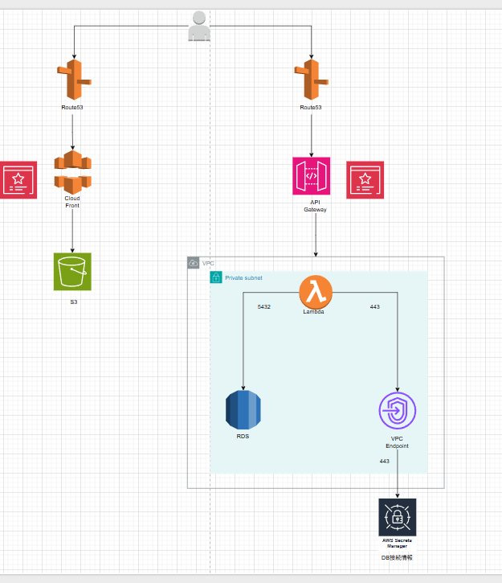

# 家計簿アプリ (Kakeibo)

個人の収支を管理するフルスタック家計簿アプリです。取引・カテゴリ・サブスクリプションの管理と月次レポート機能を提供します。

## 構成図



## 技術スタック

### フロントエンド

| 技術 | バージョン |
|------|----------|
| Next.js | 16.2.4 |
| React | 19.2.4 |
| TypeScript | 5.x |
| Tailwind CSS | 4.x |

### バックエンド

| 技術 | バージョン |
|------|----------|
| .NET (ASP.NET Core) | 8.0 |
| Entity Framework Core | 8.0 |
| PostgreSQL (Npgsql) | 8.0 |

### AWS インフラ

| レイヤー | サービス |
|---------|---------|
| フロントエンド配信 | S3 + CloudFront + Route53 + ACM |
| API | API Gateway + Lambda |
| データベース | RDS (PostgreSQL) — VPC Private subnet |
| 機密情報管理 | Secrets Manager (DB 接続情報) |
| ネットワーク | VPC + VPC Endpoint (443) |

## 機能

- **取引管理** — 収支の登録・編集・削除
- **カテゴリ管理** — 収入/支出カテゴリの一覧表示
- **サブスク管理** — 月額サービスの登録・編集・削除
- **月次レポート** — 月末処理（取引集計・削除・サブスク繰り越し）と履歴閲覧
- **ダッシュボード** — 今月の収入・支出・収支サマリー

## ローカル開発環境のセットアップ

### 前提条件

- .NET 8 SDK
- Node.js 20+
- Docker

### 1. データベース起動

```bash
docker compose up -d
```

PostgreSQL が `localhost:5432` で起動します。

### 2. バックエンド起動

```bash
cd <プロジェクトルート>
dotnet run
```

`http://localhost:5022` で API が起動します。Swagger UI は `http://localhost:5022/swagger` で確認できます。

### 3. フロントエンド起動

```bash
cd frontend
npm install
npm run dev
```

`http://localhost:3000` でアプリが起動します。

## API エンドポイント

### 取引 `/api/transaction`

| メソッド | 説明 | ボディ |
|---------|-----|-------|
| GET | 全取引取得 | — |
| POST | 取引作成 | `{ Amount, Category, Memo }` |
| PUT | 取引更新 | `{ id, categoryId, amount, memo, insertDate }` |
| DELETE | 取引削除 | — |

### カテゴリ `/api/category`

| メソッド | 説明 |
|---------|-----|
| GET | 全カテゴリ取得 |

### サブスク `/api/subscription`

| メソッド | 説明 | ボディ |
|---------|-----|-------|
| GET | 全サブスク取得 | — |
| POST | サブスク作成 | `{ Name, Amount }` |
| PUT | サブスク更新 | `{ id, name, amount }` |
| DELETE | サブスク削除 | — |

### 月次 `/api/monthly`

| メソッド | 説明 |
|---------|-----|
| GET | 月次レポート一覧取得 |
| POST | 月末処理実行（ボディなし） |

## フロントエンドのデプロイ (S3)

### ビルド

```bash
cd frontend
# .env.local の NEXT_PUBLIC_API_URL を本番 API の URL に変更してからビルド
npm run build
```

`out/` ディレクトリに静的ファイルが生成されます。

### S3 へのアップロード

```bash
aws s3 sync out/ s3://<バケット名> --delete
```

### CloudFront の設定

- オリジン: S3 バケット（OAC 使用）
- デフォルトルートオブジェクト: `index.html`
- エラーページ: 403/404 → `/index.html`（SPA ルーティング対応）

## バックエンドのデプロイ (Lambda)

```bash
dotnet tool install -g Amazon.Lambda.Tools
dotnet lambda deploy-function <関数名>
```

### 環境変数 / Secrets Manager

本番環境では `appsettings.json` の接続文字列の代わりに AWS Secrets Manager からDB接続情報を取得します。

## ディレクトリ構成

```
Kakeibo/
├── Controllers/          # API コントローラー
├── Data/                 # DbContext・初期化
├── DTO/                  # リクエスト/レスポンス DTO
├── Migrations/           # EF Core マイグレーション
├── Models/               # エンティティモデル
├── Services/             # ビジネスロジック
├── frontend/             # Next.js フロントエンド
│   └── src/
│       ├── app/          # ページ (App Router)
│       ├── components/   # UI コンポーネント
│       ├── lib/api/      # API クライアント
│       └── types/        # 型定義
├── docker-compose.yml    # ローカル DB
└── appsettings.json      # 接続文字列 (開発用)
```
