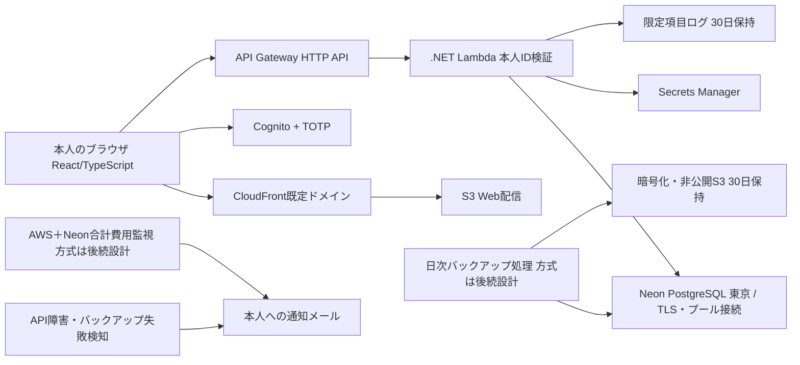

# 設計概要: 個人用家計簿アプリ

関連要件: `docs/requirements/personal-kakeibo.md`

本書は確定済みの構成と後続設計の責務を示す。具体的なAPIパス・テーブル定義・ツール等を未合意のまま確定するものではない。

## 1. 全体構成

- AWSは東京、Neonも東京。サービスの提供状況は実装前に確認する。
- Web配信、認証、API、DB、バックアップは責務を分ける。認証済みだけではなくAPIで本人IDを確認する。
- 公開前にセキュリティ・復元・性能・ブラウザ・通知の検証を完了する。基盤や途中の機能は非公開環境で単独マージ可能にする。

## 2. モジュール構成

具体ファイル名は先行Issueで決定する。以下は並行作業のための論理的所有範囲。

| モジュール / 成果物 | 責務 | 新規 / 変更 |
|---------------------|------|-------------|
| 契約文書 | DTO、エラー、再送識別、データ関係、各機能の接続点 | 新規 |
| Web共通基盤 | React/TypeScript雛形、API呼出し、送信中/エラー/入力保持の共通処理 | 新規 |
| 取引機能 | 登録・一覧・絞込・編集・削除を機能単位で実装 | 新規 |
| カテゴリ機能 | 初期データ、一覧、追加、名前変更、未使用削除 | 新規 |
| 集計機能 | 月全体の収支、カテゴリ別額・割合、表、グラフ | 新規 |
| 認証 | Cognito/TOTP UI、API認証と本人ID検証 | 新規 |
| DBマイグレーション | スキーマ・制約・初期カテゴリ・後続変更管理 | 新規 |
| IaC | Web/API/認証/秘密/ログ/バックアップ/通知の構築 | 新規 |
| 運用・検証 | バックアップ/復元、費用通知、性能・ブラウザ・公開判定証跡 | 新規 |

## 3. データモデル

確定している論理データは以下。物理スキーマ・キー・索引・再送識別保存方式は先行契約Issueで設計する。

- 取引: 日本時間の暦日、収入/支出、カテゴリ参照、日本円整数金額、任意メモ。同日内の登録順を判定できる情報が必要。
- カテゴリ: 収支種別と名称。種別変更不可。同一種別内の名称重複を禁止。名称変更が過去取引に反映され、使用中削除を拒否する関係を保つ。
- 再送識別: 同一登録リクエストだけを重複排除する。結果喪失後の再送および同時再送でも1件保存を保証する設計を定める。別の意図的登録を同額・同日という理由で排除しない。
- 一覧の順序は日付降順・登録の新しい順。並びが同値になった場合の安定順序は契約設計で定める。
- 月全体の集計は一覧の絞込と切り離す。10万件で合計金額が単一取引の上限を超えても正しく計算・表示できる型を設計する。
- データは期限なし、日次バックアップは30日。削除は通常画面で復元不可。

## 4. インターフェース仕様

### 確定した外部契約

JSON/REST、React＋TypeScript、API Gateway HTTP API＋C#/.NET Lambda、Cognito＋TOTP、NeonのTLSプール接続。具体パス・HTTPステータス・DTOは先行Issueで設計する。

### 並行実装前に確定する契約

1. 登録/編集/削除、年月一覧・絞込・50件ページ、月別集計、カテゴリ操作のリクエスト/レスポンス。
2. 項目別不正入力、通信/サーバ障害、未認証・本人以外・認証切れの区別とUIへの受け渡し。
3. 再送識別の生成・継続・更新条件およびAPI処理。入力変更後の別登録との区別。
4. 日付の暦日表現、当月の計算、文字数・カテゴリ名比較等の検証の具体化。
5. 月別集計・割合の計算、ゼロ支出・丸め、グラフへ渡す値。業務要件変更を必要とする場合はユーザーに確認。
6. 機能別ファイルの配置と共有ファイルの所有者。並行Issueは確定契約を利用し、共通ファイルの無断変更を避ける。

## 5. エラーハンドリング方針

- 不正入力は保存せず項目別表示。API側でも検証してブラウザ迂回で保存されないようにする。
- 送信中はボタン無効。通信/サーバエラーは画面内の入力保持・再試行を提供する。再読込後やオフライン永続保持は保証しない。
- 登録の再送では同一識別を維持し、結果受信失敗でも二重保存しない。
- 削除には確認、編集の競合は後の保存優先。
- 認証切れは再ログイン案内。本人以外・未認証のAPI要求は拒否。
- エラーの詳細・個人情報をログへ流さない。記録項目はリクエストID、処理時間、結果/エラー分類だけ。APIアクセスログやバックアップ処理のログも対象として確認する。

## 6. Raspberry Pi 5 固有の考慮

使用しない。CPU/メモリ、SD書込み寿命、systemd、arm64、GPIO等の要件は対象外。

## 7. テスト方針

- ユニット: 入力境界、金額整数、暦日・月境界、メモ/名称長、カテゴリ種別・重複、集計額・割合、後勝ち更新。
- 結合: 実DBでマイグレーション、カテゴリ参照、再送/同時再送、使用中削除拒否、名前変更後の過去表示、50件ページと順序、絞込と集計の独立性。
- UI: 画面内入力保持、送信中無効、項目エラー、削除確認、認証切れ、表・グラフ、リロード後の保存確認。
- セキュリティ: 未認証、本人以外（有効な別IDも含む）、MFAなし、HTTPS/CORS、DB TLS、秘密・バックアップの公開可否、ログ内容。
- 性能: 10万件・同時1人。通常時と休止後初回を分け、AWS東京のAPI往復を測定。サンプル数、データ分布、休止条件、計測位置、保存操作のデータ片付け等を実装前に文書化。p95は一覧・集計・保存それぞれ確認する。
- 復旧: 日次実行・30日保持・暗号化を確認し、公開前に実バックアップから手動復元。24時間以内のデータ損失・48時間以内の復旧への対応を記録。
- 通知: API障害/バックアップ失敗メール、AWS＋Neon合計費用の50%/80%/100%を試験。
- ブラウザ: iPhone Safari、Android Chrome、PC Chrome/Edge最新安定版。バージョンと端末を証跡に記録する。
- ハードウェア依存のモックは不要。外部サービスの単体テストは代替を使えるが、復元・認証・通知・公開設定は実環境の確認を省略しない。

## 8. 検討した代替案

| 案 | 採否 | 理由 |
|----|------|------|
| React/TypeScript＋AWSサーバーレス＋Neon | 採用（ヒアリングで指定） | 本人の指定構成 |
| Raspberry Pi 5で稼働 | 対象外 | 使用しないと確定 |
| 独自ドメイン、オフライン永続保存 | 対象外 | MVPの対象外 |
| IaCツール、バックアップ実行基盤、グラフ形式、費用通知方式 | 未選定 | ユーザーから後続設計へ委任。設計Issueで費用・対応状況を確認して選定 |

### 設計着手時の確認ゲート

- 東京リージョン対応、Lambda対応.NET LTS、Neonプール接続・バックアップの実現性と費用を確認する。
- 月3,000円目標や性能に不適合の見込みがあれば、実装前にユーザーへ相談する。合意した要件を自動的に緩和しない。
- コスト通知方式はAWSのみの通知で代用しない。両サービス合計を扱える方法を設計する。
- 共有契約・マイグレーション基盤・IaCルートの変更は担当を一本化し、確定後に機能別並行作業へ移る。
